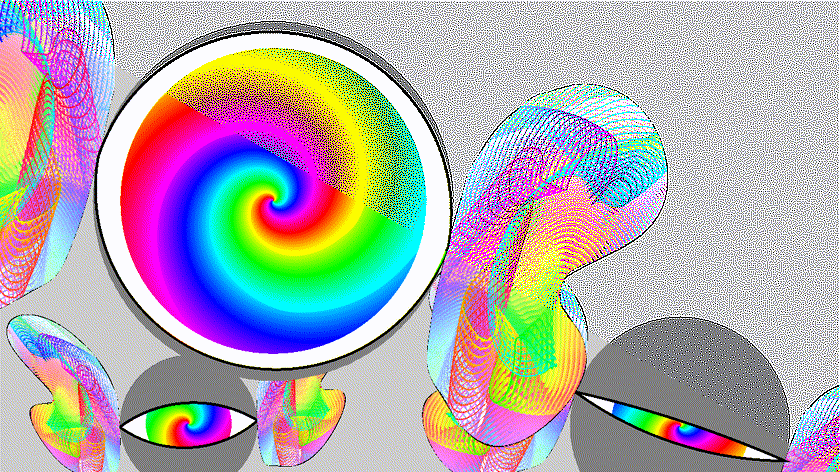
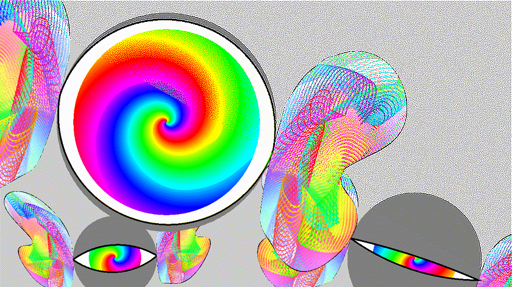

# bezeye-media

Media files for `bezeye` (https://github.com/xyzzy/bezeye)

!!  
!! This repository contains about 415M of media files.  
!!

### Welcome to the Wonderful World of Bezeye

*When illustrations are 375x larger than the code...*

This project contains the media files for: [https://github.com/xyzzy/bezeye](https://github.com/xyzzy/bezeye)

# Remastered palette

During remastering a serious bug was found and fixed in the palette creation.  
This tipped the balance for visual artifacts making a 9 colour palette a better choice than the original 7.

The effect can be seen below:

\[remastered 7 colour palette\]  


\[original 7 colour palette\]  


\[remastered 9 colour palette\]  


# Comparing side-by-side 24bit-colour against SCQ colour reduction

Below is a list of side-by-side comparisons between the 840x472 24bit-colour and different SCQ settings.  
Upto 16 colours use a 5x5 grid to calculate averages, 32 and 64 colours uses a 3x3 grid.

Down-left of diagonal is the 24bit-colour and upper-right the palette version.

Clicking on the image opens the accompanying animated GIF.

Note: GIFs are around 25Mbyte each.

\[4 colours\]  
[](sbs-840x472-4-5x5.gif)

\[5 colours\]  
[](sbs-840x472-5-5x5.gif)

\[6 colours\]  
[](sbs-840x472-6-5x5.gif)

\[7 colours\]
[](sbs-840x472-7-5x5.gif)

\[8 colours\]  
[](sbs-840x472-8-5x5.gif)

\[9 colours\]  
[](sbs-840x472-9-5x5.gif)

\[10 colours\]  
[](sbs-840x472-10-5x5.gif)

\[11 colours\]  
[](sbs-840x472-11-5x5.gif)

\[12 colours\]  
[](sbs-840x472-12-5x5.gif)

\[13 colours\]  
[](sbs-840x472-13-5x5.gif)

\[14 colours\]  
[](sbs-840x472-14-5x5.gif)

\[15 colours\]  
[](sbs-840x472-15-5x5.gif)

\[16 colours\]  
[](sbs-840x472-16-5x5.gif)

\[32 colours\]  
[](sbs-840x472-32-3x3.gif)

\[64 colours\]  
[](sbs-840x472-64-3x3.gif)

# Requirements

* `gcc` or compatible
* `libgd` for 2d graphics support [https://libgd.github.io](https://libgd.github.io)
* `mootools` for the scoreboard GUI [https://mootools.net](https://mootools.net)
* `php` for scripts
* `ffmpeg` (optional) for comparison

# Building

- Prepare `bezeye` project

    cd <pathToBezeye>
    ./autogen.sh

- Configure/Build bezeye project in media directory

    <pathToBezeye>/configure
    make
    make all-sbs

Then add referenced media to project

## Source code

This repository contains about 415M of media files.

Checkout the latest code:

```sh
  git clone https://github.com/xyzzy/bezeye-media.git
```

There are no releases due to their size.

# Versioning

Using [SemVer](http://semver.org/) for versioning. For the versions available, see the [tags on this repository](https://github.com/xyzzy/bezeye-media/tags).

# License

This project is licensed under the GNU General Public License v3 - see the [LICENSE.txt](LICENSE.txt) file for details
